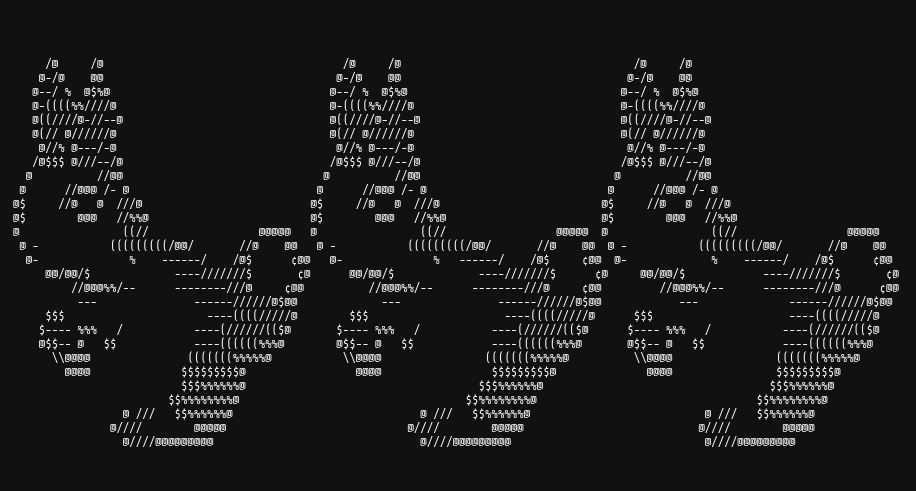

# Google Foobar Challenge



This repo contains my solutions to the Foobar Challenge, Google's secret way of hiring developers.

Back in 2023, a popup appeared when I was searching something on Google.

```
You're speaking our language. Up for a challenge? [I want to play] [No Thanks] [Don't show me this again]
```

Selecting the obvious option brought me to the [Foobar challenge](https://foobar.withgoogle.com/#), which was presented in the form of a Linux console. The challenges appeared in 5 levels, following a storyline which can be read [here](journal.md).

## Challenges

### Level 1

+ [Braille Translation]([1.1]braille-translation/)

### Level 2

+ [Don't Get Volunteered!]([2.1]dont-get-volunteered/)
+ [Please Pass the Coded Messages]([2.2]please-pass-the-coded-messages/)

### Level 3

+ [Fuel Injection Perfection]([3.1]fuel-injection-perfection/)
+ [Prepare the Bunnies' Escape]([3.2]prepare-the-bunnies-escape/)
+ [Bomb, Baby!]([3.3]bomb-baby/)

### Level 4

+ [Escape Pods]([4.1]escape-pods/)
+ [Running with Bunnies]([4.2]running-with-bunnies/)

### Level 5

+ [Disorderly Escape]([5.1]disorderly-escape/)

## Languages

Solutions could be submitted in 2 languages:

+ Java
+ Python

## Constraints

### Java

Your code will be compiled using standard Java 8. All tests will be run by calling the `solution()` method inside the `Solution` class

Execution time is limited.

Wildcard imports and some specific classes are restricted (e.g. `java.lang.ClassLoader`). You will receive an error when you verify your solution if you have used a restricted class.

Third-party libraries, input/output operations, spawning threads or processes and changes to the execution environment are not allowed.

Your solution must be under 32000 characters in length including new lines and other non-printing characters.

### Python

Your code will run inside a Python 2.7.13 sandbox. All tests will be run by calling the `solution()` function.

Standard libraries are supported except for `bz2`, `crypt`, `fcntl`, `mmap`, `pwd`, `pyexpat`, `select`, `signal`, `termios`, `thread`, `time`, `unicodedata`, `zipimport`, `zlib`.

Input/output operations are not allowed.

Your solution must be under 32000 characters in length including new lines and other non-printing characters.
